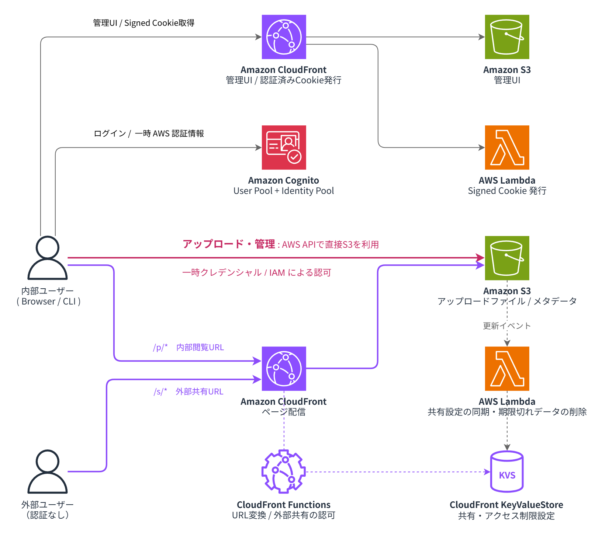

# okibasho

ちょっとしたHTMLファイルを共有するための AWS スタックです。AIエージェントで生成したアーティファクトやモック、ツールなどを、URLひとつで共有できることが目的です。

## コンセプト

- AWSの運用コストがかからないミニマムなサーバーレス構成
- 独自のAPIをもたず、S3バケットを配信するだけのプリミティブな仕様
- AWS CDKで作成・取り壊しがかんたんにできるスタック

## アーキテクチャ



- S3 にアップロードしたファイルを CloudFront で配信します
- 内部ユーザーは、Cognito Identity Pool 経由の一時クレデンシャルで S3 を直接操作します
- 内部ユーザーは、認証済みの場合はURLを知っていれば全てのページを閲覧できます
- 外部ユーザーは、外部公開を設定したページの共有URLにアクセスすることで閲覧できます

## リポジトリ構成

pnpm workspaces によるモノレポ。

| パッケージ       | 役割                                               |
| ---------------- | -------------------------------------------------- |
| `packages/infra` | AWS CDK。全 AWS リソースの定義                     |
| `packages/web`   | 管理 UI（静的 SPA。S3 をブラウザから直接操作する） |
| `packages/cli`   | アップロード用 CLI（`npx okiba`）                  |
| `packages/core`  | web と CLI が共有するページの規則と S3 操作        |

## セットアップ

```bash
pnpm install
cp packages/infra/.env.example packages/infra/.env   # デプロイ設定。EMAIL_DOMAIN は必須
```

デプロイの手順（独自ドメイン・証明書・鍵の準備、ユーザー作成、管理 UI のアップロードまで）は [docs/deploy.md](docs/deploy.md) にあります。

## よく使うコマンド

```bash
pnpm typecheck                          # 全パッケージの型チェック
pnpm test                               # 全パッケージのテスト（Vitest）
pnpm format                             # Prettier で整形
pnpm --filter @okibasho/infra synth   # CloudFormation テンプレートの生成
pnpm --filter @okibasho/infra diff    # デプロイ済みスタックとの差分
pnpm --filter @okibasho/infra deploy  # デプロイ
pnpm --filter @okibasho/web dev        # 管理UIの開発サーバー
pnpm --filter @okibasho/cli build      # CLIを単一JSにバンドル
```

## ドキュメント

- [docs/concept.md](docs/concept.md) — 何を作るか。目的・MVPスコープ・完成イメージ
- [docs/architecture.md](docs/architecture.md) — どう作るか。決定済みの設計
- [docs/roadmap.md](docs/roadmap.md) — 実装の進め方。フェーズ分けと受け入れ条件
- [docs/deploy.md](docs/deploy.md) — デプロイと運用の手順
